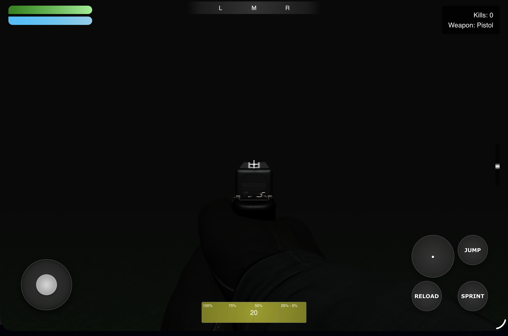
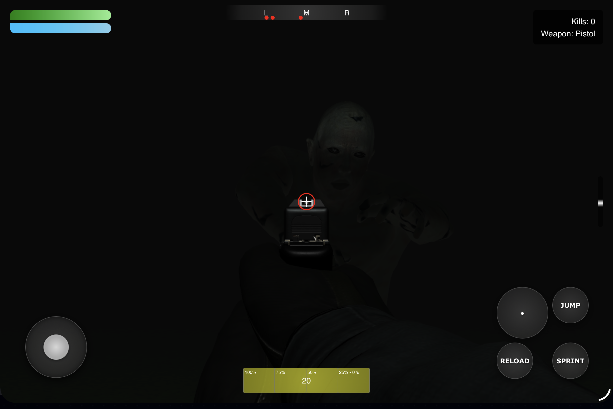
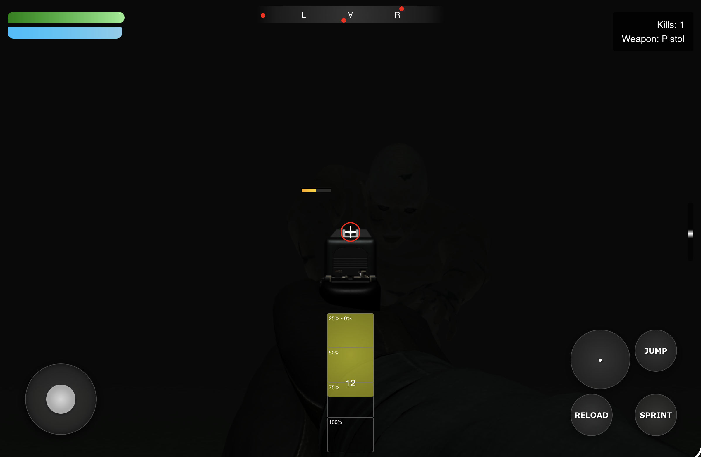
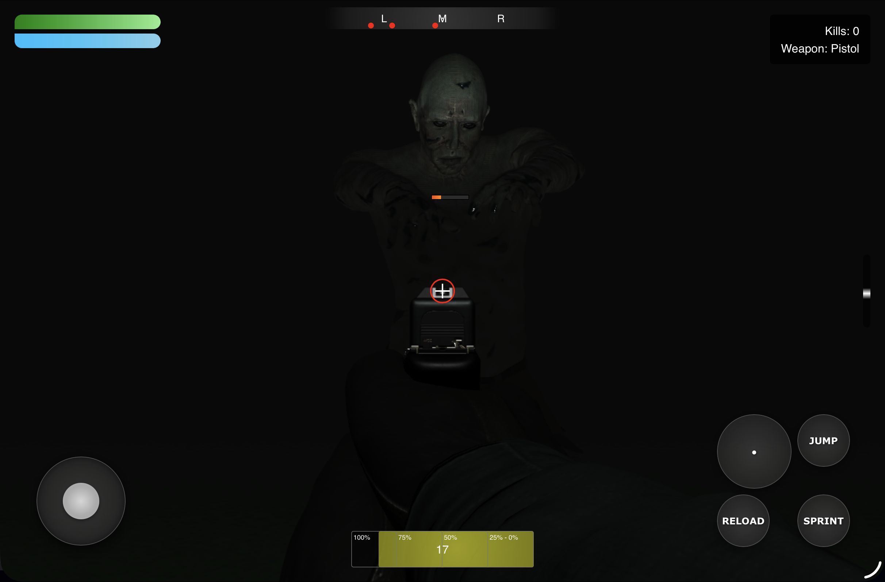
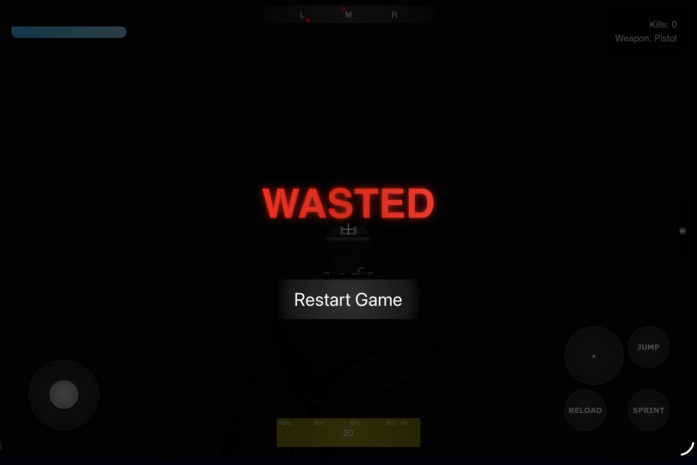

This is an FPS game made with HTML, CSS and JavaScript with the help of Three.js.
The game allows you to walk around, sprint, jump, shoot and reload.

Enemies will approach you if you are close enough, otherwise they will just walk around randomly.

When they approach, you must shoot. In order to shoot, click the big button with the dot in the middle.
It takes 4 shots to defeat an enemy. 

You have a numbers of bullets that are indicated in the bottom middle and when you used them all,
either click the reload button or shoot once more for the auto reload.

Enemies have health bars to show how much health they have left.

If the enemy comes too close, you will take damage, you heal with time but if you don't escape in time, 
you will continue to take damage until your health bar stands at 0%; and if that happens you'll have to restart.

